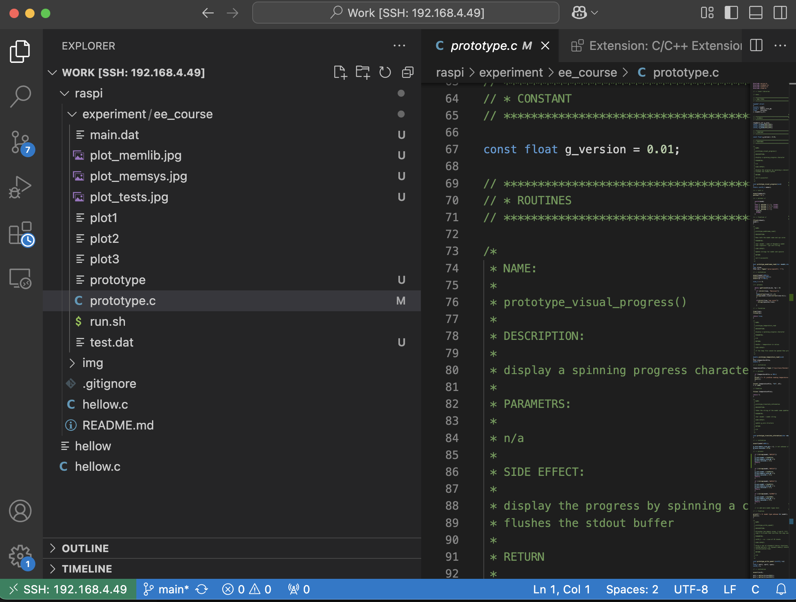
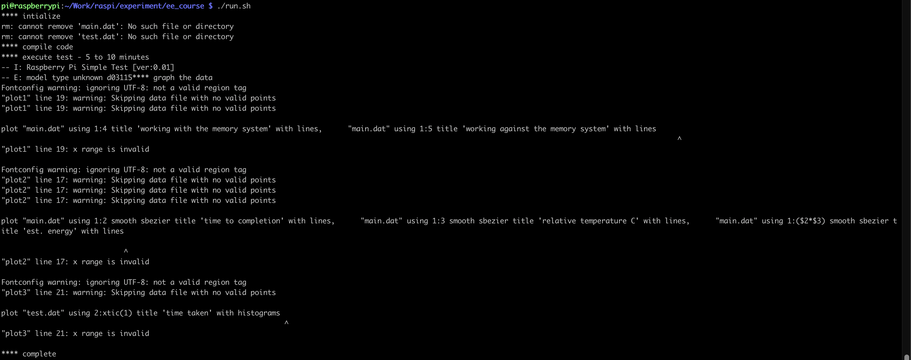
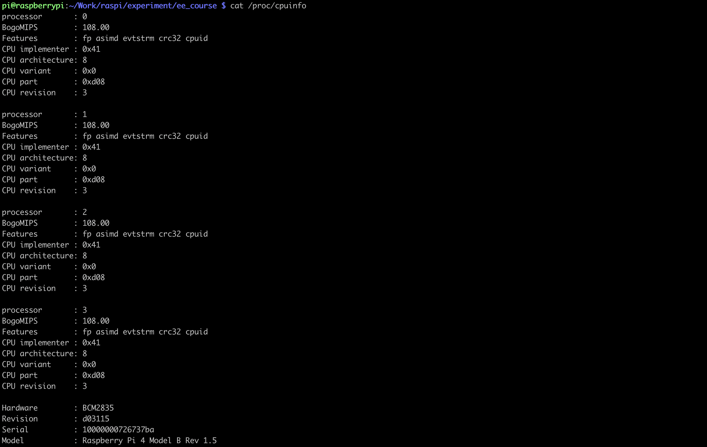
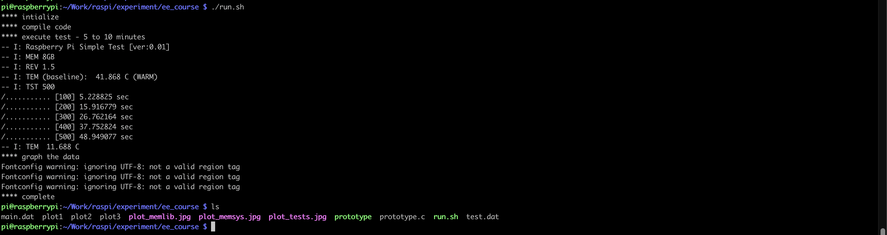
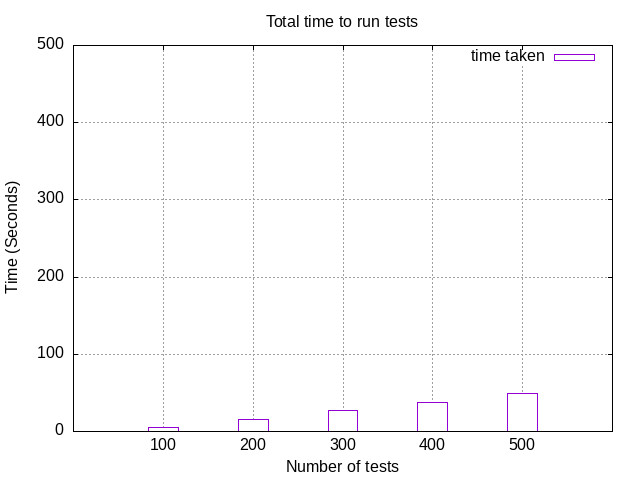
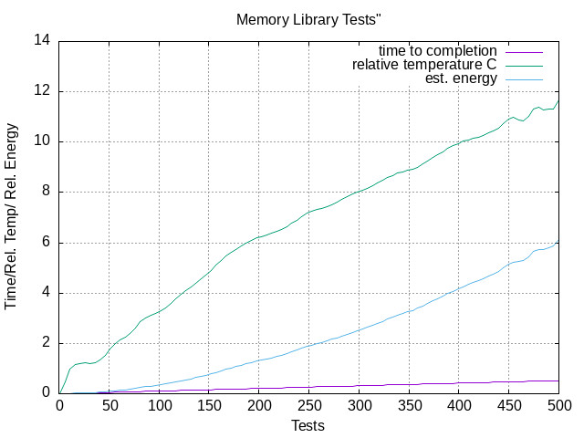
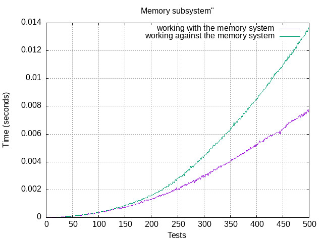

## 1. Title Page:

##### Assingment 1 : Raspberrypi 4 Configuration
##### Author(s): Ritesh Tekriwal
##### Email: rtekri@uw.edu
##### Date of submission : Jan 29, 2025


## 2. Abstract:
This Assignment outlines the Configuration for raspberrypi. The goal is to build a complete Embedded
Development Environment for Raspberry Pi 4. This environment involves setting
up the Raspberry Pi hardware platform and all the associated software. The aim is to have a
headless system (a system that operates without a monitor, graphical user interface (GUI) or
peripheral devices, such as keyboard and mouse).


## 3. Introduction:

Raspberry pi is a mini portable computer that needs an Operating System to work. This work is about how we set it up such that it can be utilised to it's full potential. The first part is about getting the right equipment and install the software. The next part is about testing the installation and running some test code to gather some performance metrics for the setup. 

#### 3.1 Equipment Required 
1. Raspberry Pi board
2. Power supply compatible with the Raspberry Pi model
3. microSD Card recommend at least 16GB (method of programming)
4. SD Card Reader
5. Wireless router (plus Ethernet ports) connected to the internet
6. Ethernet cable
7. HDMI monitor and Cable
8. Laptop/desktop with Ubuntu, Windows or Mac OS
9. USB Keyboard and mouse


#### 3.2 Steps 
1. Create boot/installation media drive
2. First Boot of Rpi
3. First Login
4. Update and upgrade all the software
5. Verification
6. Test Experiment

## 4. Methods:

#### 4.1 Create boot/installation media drive
This step is to get a SD Card ready with an Operating System and then install it on the RaspberryPi Hardware. At the end of this step you will have a SD Card ready with a RaspberryPi OS and should be ready to turn on your Pi Hardware. 

0. Insert the SD Card into the SD Card Reader and connect it to your Computer. 

The easiet way to Write an OS image is to use [Pi Imager](https://www.raspberrypi.com/software/).  
This tools helps with the following: 

1. Pick the right OS for you


[More info on the diffent OS](https://www.raspberrypi.com/software/operating-systems/)

2. Setup Login Credentials and Enable SSH


More info on [SSH](https://en.wikipedia.org/wiki/Secure_Shell)

2. Setup Wifi


Once you have specified all the above details, you can go ahead and **Write** the OS image to the SD Card. 


This should take roughly 15mins depending upon your internet connection. Once the writing is done, the tool will notify you that it is safe to eject the SD card from your Computer. 


#### 4.2 Install an Operating System


0. Ensure the power to the rpi is off and install the SD Card into the Rpi SD Card Slot
1. Power on the Rpi
     You should be able to see some lights blinking on your Rpi which denotes that the Rpi is trying to boot from the SD Card Image that you just installed. 
2. 


#### 4.3 First Login

There are 2 options to do this: 

###### 4.3.1. Desktop Login
This needs you to connect a monitor, keyboard and mouse to your rpi 

1. You can turn down the power to the RPi from Step 4.2.2 and connect a monitor, keyboad and mouse using the HDMI and USB connectors on the RPi. 
2. Power On the Rpi
3. Once booted up, you should be able to see a screen load up and the homescreen on your newly set Rpi. 


###### 4.3.2. Headless Login

*Prerequisite: Setup SSH on your PC*

If you do not need the Desktop variant and are cool enough with the headless version, you can do that in two ways:

1. Using Ethernet
    1. Connect an Ethernet Cable to your PC and the RPi
    2. Open Terminal or SSH Terminal on your PC
    3. Run the follwing command. Replace the **raspberrypiName** with the name you had set in Step 4.1.2
    ``` 
        ssh <raspberrypiName>.local
    ```
    

    4. If all goes well, you should be prompted to key in the password that you had set in 4.1.2


2. Using WiFi
    1. If you configured a WiFi network in Step 4.1.2, once the RPi is powered on, it should connect to the network automatically. 
    2. If it is connected, you should be able to ssh into the RPi wirelessly. 
    3. Run the follwing command. Replace the **raspberrypiName** with the name you had set in Step 4.1.2
    ``` 
         ssh <raspberrypiName>.local
    ```
    
    
    If this commands timeouts, this means that your computer doesn't identify the raspberrypi name and you will have to knwo the IP address of your Rpi. Repeat all the steps 4.3.1 and once you have logged in, run the following command
    ``` 
        hostname -I
    ```
    
    
    *192.168.4.49* is the IP address you are looking for. 
    
    4. Now your are ready to SSH into your RPi wirelessly. 
    Run the following command
    ``` 
        ssh pi@192.168.4.49
    ```
    
    Enter the password when prompted and you are in. You are successfully connected to the RPi wirelessly.

    

#### 4.4 Update and upgrade all the software

*You will need an active internet connection on your RPi to perform this step*

1. Package Manager Update
The package manager uses the package list to know what packages need updating and where it can download them. It polls package repositories for these lists.

Run the following command on your device to update the package list.

```
sudo apt update
```

2. Full Update
Once the package list has been updated, we can run a full upgrade on any available package.

```
sudo apt full-upgrade

```

3. Optional Kernal Updates
```
sudo apt install raspberrypi-kernel-headers

```

4. Reboot 

Once done with the above, you can reboot the RPi for the updates to work effectively.

```
sudo reboot

```

#### 4.5 Verification

Verification is the process to discover the truth, accuracy and validity. Create a file on you host PC call it something like hellow.c (basically a standard hello world test program), write the following code:

```
#include <stdio.h>

int main(void){
    printf("hello_world\n");

    return 1;
}

```

From you host PC use **scp** to copy over the files to the Raspberry Pi. 

Once the file is safely across, log into the Raspberry Pi and go to the directory where the file was placed.


Verify if the file looks okay and then compile hellow.c.
You can run the following to view the contents of the file

```
cat hellow.c
```
If the files looks right, you can compile it by running the following

```
gcc hellow.c -o hellow
```

Next you can execute the compiled code to see the results

```
./hellow
```


If you are susccessfully able to see the results, it is safe to conclude that your RPi setup is working. 


Optional Method to copy files to your RPi

[**rsync**](https://linux.die.net/man/1/rsync)

You can run the follwing command to effectively keep the files upto date between your host computer and RPi

```
rsync -a --exclude="/.*"  pi@192.168.4.49:<RPi Folder Path>. <Host PC Folder>/.

```


This keeps the files in the folder names *raspi* on the Host PC upto date with the same folder on the RPI. 
The exclude arguements ignores any hidden folder such as git history or files

#### 4.5 Test Experiment

1. Setup Verison Control (Github)
First things first, a github repository was created to keep all the code in one place. 

https://github.com/tekritesh/raspi

*Optional* Setup VSCode SSH 
If you are using VSCode as your IDE for coding, you can install the [Remote SSH Client](https://marketplace.visualstudio.com/items?itemName=ms-vscode-remote.remote-ssh) which let's you edit code and access all the files from the RPi as if it were host computer.  



2. Downloaded ee course.zip from Canvas: located files/Assignments/ee course.zip was unzipped in this repo [here](https://github.com/tekritesh/raspi/tree/main/experiment/ee_course)

3. Unzip, i.e., unzip ee course.zip

4. Run **rsync** to copy the experiment code onto the RPi. 

```
rsync -a --exclude="/.*"  pi@192.168.4.49:/home/pi/Work/raspi/. raspi/.

```

5. Install Gnuplot on RPi

```
sudo apt install gnuplot

```

6. Execute the experiment shell script

```
./run.sh

```

This errors out since it is not able to find the version of RPi



On further investigation it was found that the error was in [*prototype_translate_information*]( https://github.com/tekritesh/raspi/blob/main/experiment/ee_course/prototype.c#L257) function where the RPi used did not match any of the given models. So appropriate changes were by adding this to the [code] https://github.com/tekritesh/raspi/blob/main/experiment/ee_course/prototype.c#L257

```
 if (!strcmp(model,"d03115"))
  {
  g_core.model = 0xd03115;
  g_core.memory_size_gb = 8;
  g_core.revision = 1.5;
  return;
  } 

```
These details can be found by running the following command on the RPi Terminal

```
cat /proc/cpuinfo

```




Rerunning the shell script, the code executed successfully and generated the expected graphs.




## 5. Results:

#### Fig1 Total Time to Run the Tests


#### Fig2 Memory Library Tests


#### Fig3 Memory Subsystem Tests



## 6. Discussion:
- From Fig1 we can see as the number of tests increases, the time taken to execute them also increases.
- From Fig2 we can see at the number of tests increase on the X-axis, the temperature as well as the energy consumed by the CPU increase almost linearly with the number of tests.
- From Fig3 compares the two ways the  matrix addition operation is performed for the same dimension of the two input matrices. 


## 7. Conclusion:
• Summarize the main findings
• Emphasize the significance of the results

## 8. References:
- [Wikipedia](https://www.wikipedia.org/)
- [RaspberryPi](https://www.raspberrypi.com/)
- [StackOverFlow](https://stackoverflow.com/)

## 9. Acknowledgments:


## 10. Appendices:


## 11. Figures and Tables:

