## 1. Title Page:

##### Assingment 2 : Raspberrypi 4 Exploration
##### Author(s): Ritesh Tekriwal
##### Email: rtekri@uw.edu
##### Date of submission : Feb 12, 2025

## 0. C Profiency:
Intermediate 


## 2. Objective:
This Assignment is about exploring the capabilities of the Raspberry Pi 4 i.e the software, features, options and potential limitations. In this Assignment,we are going to characterize the target board hardware and software by using the C programming language.


## 3. Introduction:

Raspberry pi is a mini portable computer that needs an Operating System to work. This work is about how we characterise the board to understand it's capabilities and potential. 

#### 3.1 Equipment Required 
1. Raspberry Pi board with Installed Firmware
2. Power supply compatible with the Raspberry Pi model
5. Wireless router (plus Ethernet ports) connected to the internet

## 4 Characterization Questions
### 4.1. What SoC is on the target board? What version and manufacturer of the SoC?

To get the SOC of the target board,  we need to get info like version and Revision ID.


```
cat /proc/cpuinfo 

```

This returns the Revison ID ie **d03115** which when crossreferenced on the [website](https://www.raspberrypi.com/documentation/computers/raspberry-pi.html)  tells us that the it **Version 1.5** manufactured by **Sony UK** 

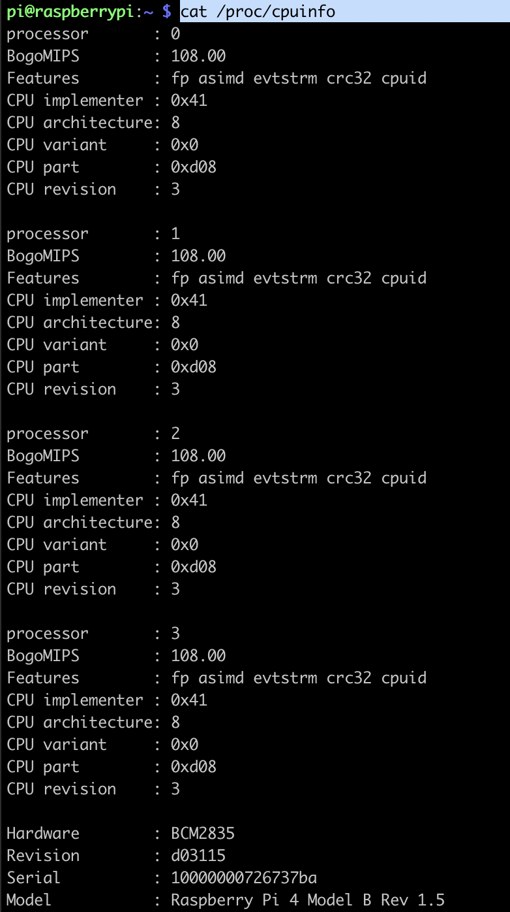


### 4.2. What features are present on the board/SoC?
This can be divded into the following groups: 

#### Performance & GPU
```
SoC: Broadcom BCM2711
CPU: Quad-core Cortex-A72 (ARM v8, 64-bit, 1.5 GHz)
    Cores:4
    Clock Speed: ~1.5GHz ( max 1.8Ghz, min 0.6Ghz)
    Threads per Core : 1
    Intruction Set: AArch64
GPU: Broadcom VideoCore VI
    Clock Speed: ~500MHz
Graphics support: OpenGL ES 3.1, 4K decoding (H.265), dual-display
```

#### Memory(RAM)
```
Type: LPDDR4-3200 SDRAM 
Memory Speed: 3200 MT/s (MegaTransfers per second)
Memory Bus Width: 32-bit
Shared Memory: CPU & GPU share RAM (adjustable via firmware)
Sizes: 2GB

```

#### Storage
MicroSD slot (for OS & storage)
USB boot support (boot from SSD/HDD via USB 3.0)

#### Display & Graphics
```
Dual micro-HDMI ports (supports two 4K displays @ 60Hz)
Supports H.265 (HEVC) 4Kp60 decode, H.264 1080p60 encode/decode
OpenGL ES 3.1 support
```
#### Connectivity

```
Wi-Fi: 802.11ac (dual-band 2.4GHz / 5GHz)
Bluetooth: 5.0 (BLE)
Gigabit Ethernet (true 1 Gbps speed)
USB Ports:
    2 × USB 3.0 
    2 × USB 2.0
GPIO: 40-pin 
```

#### Power
Power input: USB-C (5V/3A)


### 4.3. What size caches are present in the Raspberry Pi?

This can be found by running the following

```
lscpu

```


```
L1d cache:128 KiB
L1i cache:192 KiB
L2 cache:1 MiB
```

### 4.4. What is the pin layout on this specific version of the target board?

Pinout found by running the following
```
pinout 
```
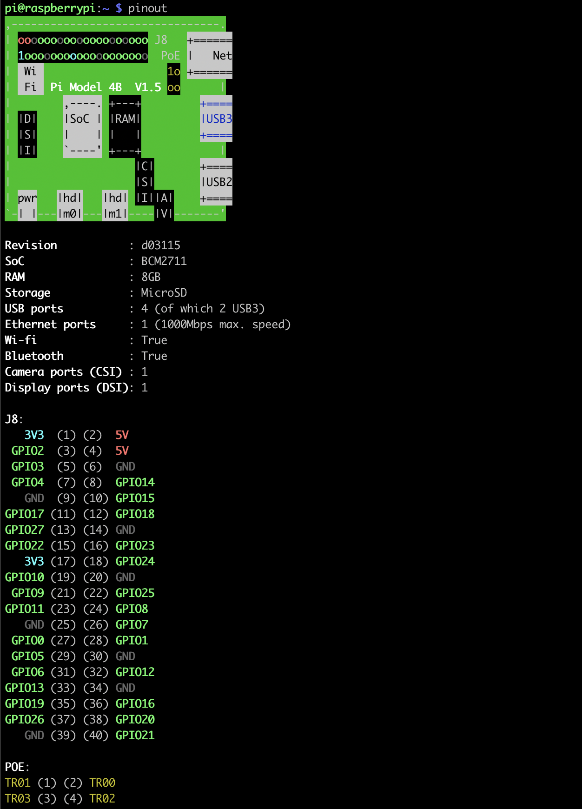

### 4.5. How does the board boot? What is the process?
```
Power On: The Pi powers up, and the Boot ROM in the GPU begins executing.

Stage 1 (bootcode.bin): Loads the initial bootloader, sets up memory.

Stage 2 (start.elf & config.txt): Initializes the ARM processor and loads the kernel.

Linux Kernel: Initializes the operating system and mounts the root filesystem.

Init Process: Starts system services and presents a user interface
```

### 4.6. How much memory is available on the board?

Memory Info can be found by running
```
lscpu
```


### 4.7. How many different types of memory are on the board? 

```
RAM (LPDDR4-3200) – Main system memory (2GB, 4GB, or 8GB depending on the model).

microSD Card – Boot device and persistent storage for the OS and files.

GPU Shared Memory (VideoCore IV) – Graphics processing memory (shared with RAM).

EEPROM – Bootloader storage, non-volatile memory for boot configuration.
```

### 4.8. What is the name and release version of the Operating System used on the target board?

OS info can be found by 
```
cat /etc/os-release

```

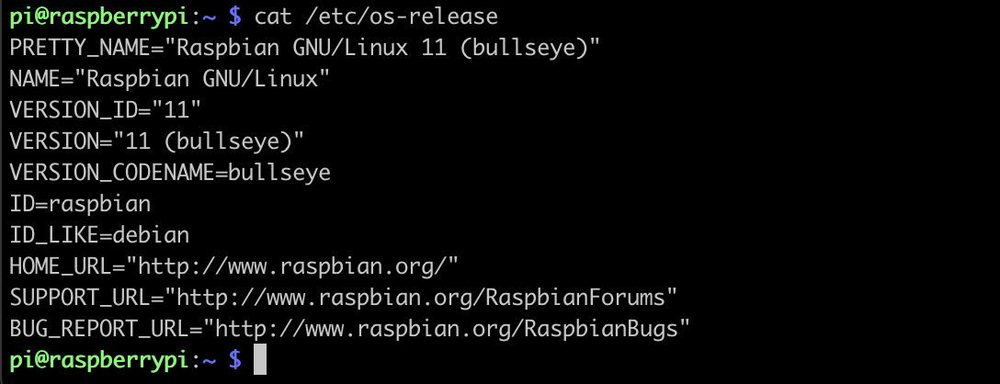

### 4.9. What is the compiler name and version?

Compiler info can be found by

```
gcc --version

```
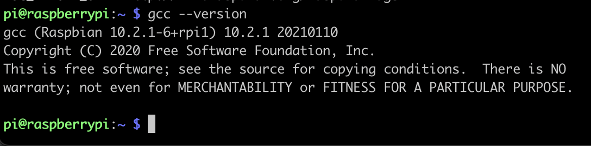


### 4.10. How long does it take for a context switch?

To test this, a context switch script was written [here](https://github.com/tekritesh/raspi/blob/main/experiment/ee_course/ctx_measure.c)

```
gcc ctx_measure.c -o ctx
sudo ./ctx
```


### 4.11. What is the interrupt latency for the board? E.g., from an interrupt to the first instruction executed in the service routine?

The Interrupt was latched on GPIO 17, where the interrupt Rising Trigger was manually generated with a jumper connected to 3V3. 

To test this, a script was written [here](https://github.com/tekritesh/raspi/blob/main/experiment/ee_course/interrupt_latency.c)
 
The script uses **RPi.GPIO** package to get the pin status.  To install


```
sudo apt-get update
sudo apt-get upgrade
sudo apt-get install python-pip python-dev
sudo pip install RPi.GPIO  

```

```
gcc interrupt_latency.c -o interr
sudo ./interr
```

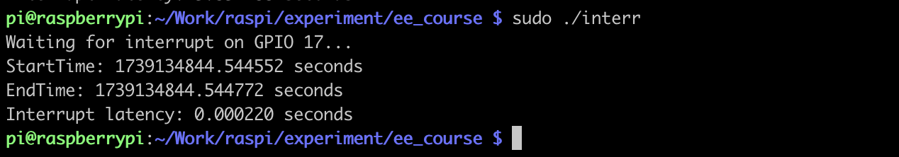


### 4.12. How much time does it take to copy 1 KB, 1 MB, and 1GB in bytes, half words, and words in RAM?

To test this, a script was written [here](https://github.com/tekritesh/raspi/blob/main/experiment/ee_course/mem_ram_cp.c)

```
gcc mem_ram_cp.c -o memram
./memram

```

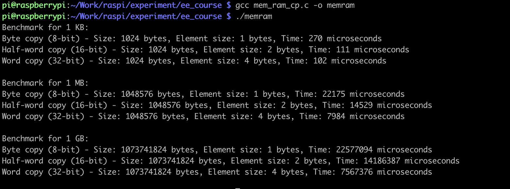

### 4.13. How much time does it take to copy 1 KB, 1 MB, and 1GB in bytes, half words, and words on the filing system?

To test this, a script was written [here](https://github.com/tekritesh/raspi/blob/main/experiment/ee_course/mem_sd_cpy.c)

To generate files of 1 KB, 1 MB, and 1GB in bytes you can run the following
```
dd if=/dev/urandom of=test_1KB.bin bs=1K count=1
dd if=/dev/urandom of=test_1MB.bin bs=1M count=1
dd if=/dev/urandom of=test_1GB.bin bs=1G count=1


```

Next, you can execute the script by running 

```
gcc mem_sd_cpy.c -o memsd
sudo ./memsd

```

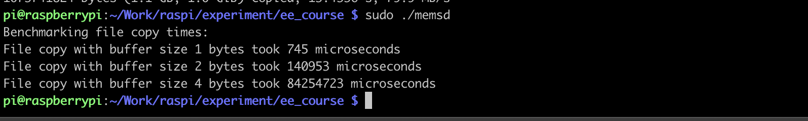

### 4.14. How long does it take between reboot and an active board? Is it deterministic?


This was done by executing a C script on the host PC which connects to RPi over SSH server, sends the reboot command, keeps pinging to check if the board is alive or not. 

The C script was written [here](https://github.com/tekritesh/raspi/blob/main/experiment/ee_course/reboot_time.c) . It takes an arguement to either reboot or halt

```
gcc reboot_time.c -o reboottime
./reboottime reboot
```

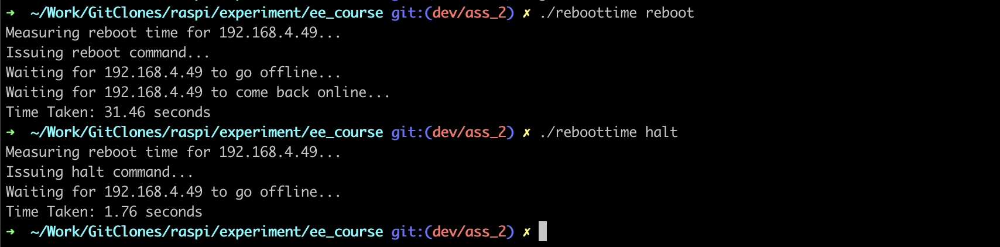

No, the reboot time is not deterministic by default while running the Raspberry Pi OS.  It is because of filesystem checks, some OS service initialisations etc.  It can be made deterministics by optimising some of the boot up services, moving to a read-only filesystem, or by using OS Lite which avoids GUI boot up. 

### 4.15. How long does it take to halt the board? Is it deterministic?


This was done by executing a C script on the host PC which connects to RPi over SSH server, sends the reboot command, keeps pinging to check if the board is alive or not. 

The C script was written [here](https://github.com/tekritesh/raspi/blob/main/experiment/ee_course/reboot_time.c) . It takes an arguement to either reboot or halt

```
gcc reboot_time.c -o reboottime
./reboottime halt
```


### 4.16. Determine the speed of integer arithmetic with a benchmark.

This was done by executing a C script that performs 4 math operations ie addition, substraction, multiplication and division for 1 billion times. It even takes an arguement for either interger or float point calculations. 

The C script can be found [here](https://github.com/tekritesh/raspi/blob/main/experiment/ee_course/arithmetic_benchmark.c)


```
gcc arithmetic_benchmark.c -o arithmeticbenchmark
./arithmeticbenchmark integer
```

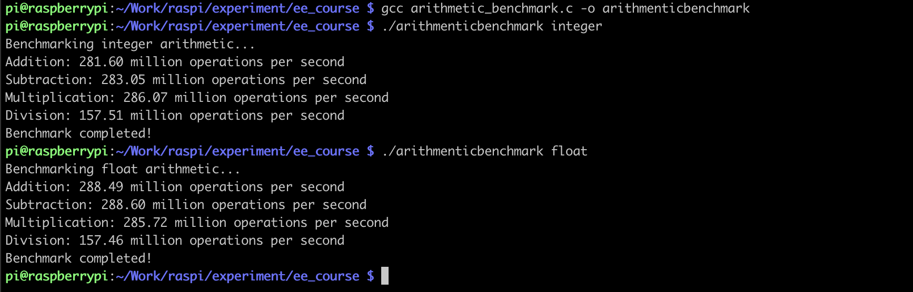

### 4.17. Determine the rate of floating-point arithmetic with a benchmark.

```
gcc arithmetic_benchmark.c -o arithmeticbenchmark
./arithmeticbenchmark float
```


### 4.18 Write a multithreaded example application that illustrates the producer-consumer algorithm with protected data running on multiple processors.

This was written such the 4 parallel threads (2 consumers and 2 producers) are created and a random generate data is shared between the producer and the consumer

The C script can be found [here](https://github.com/tekritesh/raspi/blob/main/experiment/ee_course/multithread.c)


```
gcc multithread.c -o multithread -pthread

```

### 4.19 What are the operating temperature ranges?

For Raspberry Pi 4 Model B can operate between 0-85 degrees Celcius

### 4.20 What is the power consumption without load and with load?

For Raspberry Pi 4B(2GB) the no load power consumption is 3.4 watts  where as Full Load is 7.6 watts.
Unfortunately I did not have a smart meter to measure. I could measure the temperature, power and frequency with a script but that is not direct indicator of the power consumption. 

### 4.21 What would be a useful stress test to determine reliability?


Putting the system under maximum CPU, GPU, memory and I/O would definitely test the realiability of the Raspberry Pi. 

One such tests is to continuously calculate prime numbers.  An exmaple [code](https://github.com/tekritesh/raspi/blob/main/experiment/ee_course/stress.c) was written with monitoring enabled to see how the CPU behaves under this stress load. 


```
gcc stress.c -o stresstest -lm -pthread

```

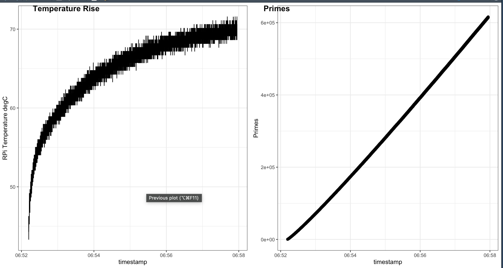

### 4.22 Does temperature affect performance?

The SoC (System on Chip) may throttle performance when it reaches around 80°C to prevent overheating.


### 4.23 Determine how much energy is required to run a benchmark. E.g., use temperature as a rough guide.

The relation between power and temperature is complex as an increase in dynamic power increases the total power, which increases the temperature, which increases the leakage power, which increases the total power, which increases the temperature.
For a rough guide, Rpi Consumes

```
45-55degC : 2-3watts
55-70degC : 4-5watts 

```

With that said, in the stress test performed, the total energy would look like this : 

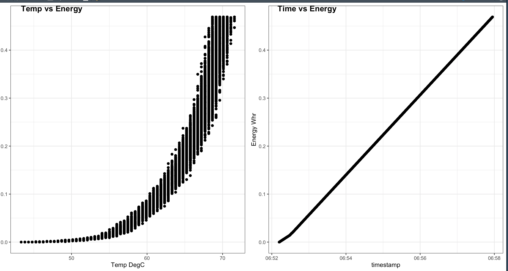


----

## 5 Project Stuff

### 5.1 Introduction
Finding a parking spot in downtown of any city is a major issue and especially with Return to Office policies, this can even intensified.  Moreover, if you live in downtown and prefer to walk, unruly weather is quite an annoyance. Here is an attempt to use Traffic Cams to find parking spots and stress wise weather updates in near real time. 


[Seattle Gov](https://www.seattle.gov/) has an extensive array of Traffic Cameras spread across the city that update the image and sometimes videos every minute. 


The cameras are located on all major jucntions and crossings and have a decent picture as you can see 

 


This project aims at querying this data, make a cache, and then run some object detection model on these images to find cars parked by the curbs.

A stretch goal is to detect the weather conditions by these images and get a near real time update if it is convinient to walk down a few blocks.

Finally, this could all be overlaid as a custom layer on Open Street Maps. 

### 5.2 How to fetch images from a server?

Python Package **requests** seems like an option to download images from a url


### 5.3 How to run YOLO on Rpi?

Ultralytics has some info [here](https://docs.ultralytics.com/guides/raspberry-pi/).
A quick check with this on PC looked promising.


### 5.4 OpenCV on Rpi?

This maybe used for some segmentation

### 5.5 Package Manager to deploy cross architectures and PCs.

[Poetry](https://python-poetry.org/) seems to be promisiong for package creation and deployment. 

### 5.6 System Service 

This is to keep running the pipeline on the rpi when it is powered on

[Crontab](https://bc-robotics.com/tutorials/setting-cron-job-raspberry-pi/?srsltid=AfmBOopibJL8Bb3RArlvy8qq1L8XFUEb-gmexj-lIBD0Otu6Lafi7XW8) seems to be a way to get this done.


## 7. Conclusion:

The temperature monitoring will definitely come handy when machine learning models like  Yolo has to be deployed on Pi. 

The project may need some lightweight machine learning to segment images. The idea here is write the package such that it could be deployed on multiple architectures and OS. 

Some of the new tools like  [Renode](https://renode.io/) which lets you simulate actual hardware will definitely reduce the hardware development iterations. Moreover the embedded development work can begin much before the physical hardware comes in hand. 


## 8. References:
- [Wikipedia](https://www.wikipedia.org/)
- [RaspberryPi](https://www.raspberrypi.com/)
- [StackOverFlow](https://stackoverflow.com/)
- [ChatGPT](https://chatgpt.com/)
