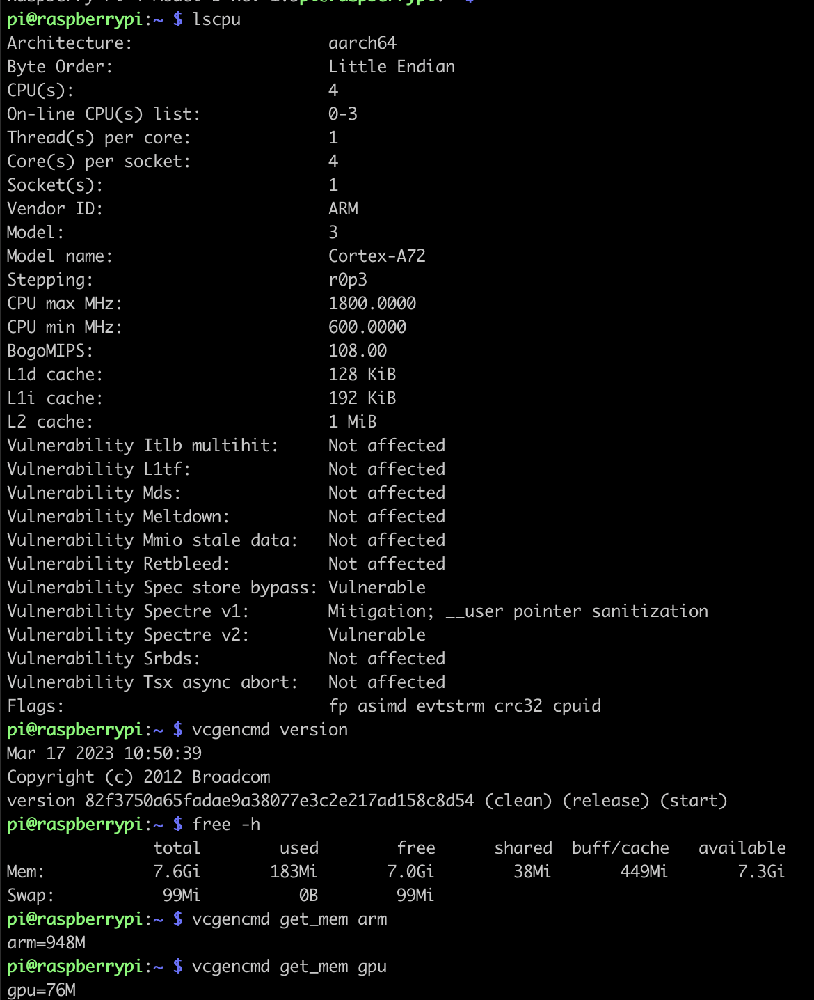

## 1. Title Page:

##### Assingment 2 : Raspberrypi 4 Exploration
##### Author(s): Ritesh Tekriwal
##### Email: rtekri@uw.edu
##### Date of submission : Feb 12, 2025


## 2. Abstract:
This Assignment is about exploring the capabilities of the Raspberry Pi 4 i.e the software, features, options and potential limitations. In this Assignment,we are going to characterize the target board hardware and software by using the C programming language.


## 3. Introduction:

Raspberry pi is a mini portable computer that needs an Operating System to work. This work is about how we characterise the board to understand it's capabilities and potential. 

#### 3.1 Equipment Required 
1. Raspberry Pi board with Installed Firmware
2. Power supply compatible with the Raspberry Pi model
5. Wireless router (plus Ethernet ports) connected to the internet

## 4 Characterization Questions
### 4.1. What SoC is on the target board? What version and manufacturer of the SoC?

To get the SOC of the target board, first we need to get info like version and Revision ID.

```
cat /proc/cpuinfo 

```


This returns the Revison ID ie **d03115** which when crossreferenced on the [website](https://www.raspberrypi.com/documentation/computers/raspberry-pi.html)  tells us that the it **Version 1.5** manufactured by **Sony UK** 


### 4.2. What features are present on the board/SoC?
This can be divded into the following groups: 

#### Performance & GPU
SoC: Broadcom BCM2711
CPU: Quad-core Cortex-A72 (ARM v8, 64-bit, 1.5 GHz)
    Cores:4
    Clock Speed: ~1.5GHz ( max 1.8Ghz, min 0.6Ghz)
    Threads per Core : 1
    Intruction Set: AArch64
GPU: Broadcom VideoCore VI
    Clock Speed: ~500MHz
Graphics support: OpenGL ES 3.1, 4K decoding (H.265), dual-display

#### Memory(RAM)
Type: LPDDR4-3200 SDRAM 
Memory Speed: 3200 MT/s (MegaTransfers per second)
Memory Bus Width: 32-bit
Shared Memory: CPU & GPU share RAM (adjustable via firmware)
Available Sizes: 2GB, 4GB, and 8GB models


#### Storage
MicroSD slot (for OS & storage)
USB boot support (boot from SSD/HDD via USB 3.0)

#### Display & Graphics
Dual micro-HDMI ports (supports two 4K displays @ 60Hz)
Supports H.265 (HEVC) 4Kp60 decode, H.264 1080p60 encode/decode
OpenGL ES 3.1 support

#### Connectivity
Wi-Fi: 802.11ac (dual-band 2.4GHz / 5GHz)
Bluetooth: 5.0 (BLE)
Gigabit Ethernet (true 1 Gbps speed)
USB Ports:
    2 × USB 3.0 
    2 × USB 2.0
GPIO: 40-pin 

#### Power
Power input: USB-C (5V/3A)


### 4.3. What size caches are present in the Raspberry Pi?

```
lscpu

```


L1d cache:128 KiB
L1i cache:192 KiB
L2 cache:1 MiB

### 4.4. What is the pin layout on this specific version of the target board?

```
pinout 

```


### 4.5. How does the board boot? What is the process?

Power On: The Pi powers up, and the Boot ROM in the GPU begins executing.
Stage 1 (bootcode.bin): Loads the initial bootloader, sets up memory.
Stage 2 (start.elf & config.txt): Initializes the ARM processor and loads the kernel.
Linux Kernel: Initializes the operating system and mounts the root filesystem.
Init Process: Starts system services and presents a user interface

### 4.7. How much memory is available on the board?


### 4.8. What is the maximum memory configuration?


### 4.9. How many different types of memory are on the board?

RAM (LPDDR4-3200) – Main system memory (2GB, 4GB, or 8GB depending on the model).
microSD Card – Boot device and persistent storage for the OS and files.
GPU Shared Memory (VideoCore IV) – Graphics processing memory (shared with RAM).
EEPROM – Bootloader storage, non-volatile memory for boot configuration.

### 4.10. What is the performance of the memory?


### 4.11. What is the name and release version of the Operating System used on the target board?

```
cat /etc/os-release

```


### 4.12. What is the compiler name and version?

```
gcc --version

```


### 4.13. How long does it take for a context switch?


### 4.14. What is involved in adding an on-switch to the Raspberry Pi?
### 4.15. What is the interrupt latency for the board? E.g., from an interrupt to the first instruction executed in the service routine?


```
sudo apt-get update
sudo apt-get upgrade
sudo apt-get install python-pip python-dev
sudo pip install RPi.GPIO  

```


### 4.16. How much time does it take to copy 1 KB, 1 MB, and 1GB in bytes, half words, and words in RAM?


### 4.17. How much time does it take to copy 1 KB, 1 MB, and 1GB in bytes, half words, and words on the filing system?

```
dd if=/dev/urandom of=test_1KB.bin bs=1K count=1
dd if=/dev/urandom of=test_1MB.bin bs=1M count=1
dd if=/dev/urandom of=test_1GB.bin bs=1G count=1


```


### 4.18. How long does it take between reboot and an active board? Is it deterministic?


No, the reboot time is not deterministic by default while running the Raspberry Pi OS.  It is because of filesystem checks, some OS service initialisations etc.  It can be made deterministics by optimising some of the boot up services, moving to a read-only filesystem, or by using OS Lite which avoids GUI boot up. 

### 4.19. How long does it take to halt the board? Is it deterministic?


### 4.20. Determine the speed of integer arithmetic with a benchmark.


### 4.21. Determine the rate of floating-point arithmetic with a benchmark.


### 4.22 Write a multithreaded example application that illustrates the producer-consumer algorithm with protected data running on multiple processors.

```
gcc multithread.c -o multithread -pthread

```

### 4.23 What are the operating temperature ranges?

For Raspberry Pi 4 Model B can operate between 0-85 degrees Celcius

### 4.24 What is the power consumption without load and with load?

For Raspberry Pi 4B(2GB) the no load power consumption is 3.4 watts  where as Full Load is 7.6 watts

### 4.25 What would be a useful stress test to determine reliability?


Putting the system under maximum CPU, GPU, memory and I/O would definitely test the realiability of the Raspberry Pi. 

One such tests is to continuously calculate prime numbers.  An exmaple code [stress.c]() was written with monitoring enabled to see how the CPU behaves under this stress load. 


```
gcc stress.c -o stresstest -lm -pthread

```

### 4.26 Does temperature affect performance?

The SoC (System on Chip) may throttle performance when it reaches around 80°C to prevent overheating.


### 4.27 Determine how much energy is required to run a benchmark. E.g., use temperature as a rough guide.


<Questions for Project>
With reference to the project mentioned here <link>, here are some questions to explore the pieces and do a feasibility analysis.  

### 5.1 How do setup BLE work on RPI? 
The commandline *bluetoothctl* is a good way to turn/off and pair devices. 

```
bluetoothctl scan on
bluetoothctl pair <MAC Address>
```
In case you want to filter a specific bluetooth device by name


``` 
bluetoothctl scan on | grep <device name>

```

### 5.2 How are Sonos Speakers Controlled over Wifi?

### 5.3 How to connect a microphone to the Rpi? Digital vs Analog Microphone?

### 5.4 What is the latency between tx audio signal to the time it takes on the speaker system?

### 5.6 Pyaudio


## 5. Results:


## 6. Discussion:


## 7. Conclusion:

## 8. References:
- [Wikipedia](https://www.wikipedia.org/)
- [RaspberryPi](https://www.raspberrypi.com/)
- [StackOverFlow](https://stackoverflow.com/)
- [ChatGPT](https://chatgpt.com/)

## 9. Acknowledgments:


## 10. Appendices:


## 11. Figures and Tables:

